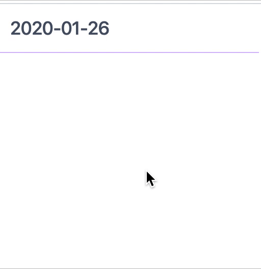

# Vue Tailwind Datepicker
Datepicker component based on Tailwind and Vue

[]()





**Table of Contents**

- [Getting started](#getting-started)
- [Usage](#usage)
  - [Npm](#npm)
  - [Browser](#browser)
- [Usage](#usage)
  - [Props](#props)
- [Credits & Contributors](#credits-&-contributors)

##Requirements
Some prerequesities are required, so i suppose you have tailwind.css and vue.js already in place in your app.
If not, first install [Tailwind.css](https://tailwindcss.com/docs/installation/) and [Vue.js](https://vuejs.org/v2/guide/installation.html).

## Getting started
- Install the plugin:

    Yarn
    ```$xslt
    yarn add @coding-wisely/vue-tailwind-datepicker
    ```
   Npm
    ```
    npm install @coding-wisely/vue-tailwind-datepicker
    ```
## Usage
- Add VueTailwindDatepicker into your app:

  ```javascript
  import VueTailwindDatepicker from 'vue-tailwind-datepicker'

  Vue.use(VueTailwindDatepicker)
  ```

- Use the `vue-tailwind-datepicker` component:

  ```html
    <vue-tailwind-datepicker />
  ```

## Installation
### npm
```bash
  yarn add @coding-wisely/vue-tailwind-datepicker
```

Then use the component directly:

```html
<!-- your-component.vue-->
<template>
  <vue-tailwind-datepicker v-model="date" @input="setStartDate"></vue-tailwind-datepicker>
</template>
<script>
import { VueTailwindDatepicker } from '@coding-wisely/vue-tailwind-datepicker'

export default {
    components: {
        VueTailwindDatepicker,
    },
    data(){
        return {
            startDate: '',
            form: {}
        }
    },
    methods: {
        setStartDate(startDate) {
            this.form.startDate = startDate;
        }
    }
};
</script>
```

### Browser

Include script into your html page before closing body tag . It must be included after Tailwind.css and Vue.js are loaded.

```html
<script src="https://unpkg.com/@coding-wisely/vue-tailwind-datepicker"></script>
```

**If Vue is detected in the Page, the plugin is installed automatically.**

Manually install the plugin into Vue:

```javascript
Vue.use(VueTailwindDatepicker)
```

Or use the component directly:

```javascript
Vue.component('vue-tailwind-datepicker', VueTailwindDatepicker)
```

### Props

  Test all props on [Code Pen](https://codepen.io/thcoder/pen/JjozmeE?editors=1111).
  
  **IMPORTANT**
  
  Props shall be called with hypens. 
  
  __Example:__ `<vue-tailwind-datepicker picker-wrapper-classess="flex w-full" />`
  
  **REMEMBER**
   
  
  If you ad props classes, dont forget that defaults on particular props classes will not be applied at all, default will be ignored, and only your, props class will be applied.
  Means, `<vue-tailwind-datepicker input-field-classess="w-full" />` will be applied on input field, and default classes on input field will be ignored. 
  

  | Property | Type | Default value | Description |
  | -------- | ---- | ------------- | ----------- |
  | `pickerWrapperClasses` | `String` | `w-64` | CSS class that wraps component |
  | `inputFieldClasses` | `String` | `focus:outline-none cursor-pointer  w-full bg-white h-12 p-3 border-b border-purple-300 text-lg font-medium text-gray-700` | input field class |
  | `pickerMonthSelectionClasses` | `String` | `flex justify-between h-12 w-full p-2 items-center bg-purple-100 uppercase` | Datepicker header class with Month, Year and Previos and Next buttons| 
  | `pickerDaysHeaderClasses` | `String` | `flex w-full w-full justify-start text-center p-2` | Datepicker Days header (Su, Mo, Tu...) |
  | `calendarWrapperClasses` | `String` | `flex w-full border-l border-r border-b border-purple-100 justify-start text-center flex-wrap` | Wrapper around month calendar |
  | `selectedDayClasses` | `String` | `bg-purple-500 text-white` | CSS classes applied on date selected in month calendar |
  | `currentDayClasses` | `String`| `bg-purple-300 text-white` | CSS Classess applied on current date `input` |
  | `chevronClasses` | `String` | `w-10 h-10` | CSS classess applied on Previous and Next SVG |
  | `dateFormat` | `String` | `YYYY-MM-DD` | Javascript moment library date format|
  | `preselectedDay` | `String` | `` | Javascript moment library date format and it shall match deafult dateFormat above |
  | `closeOnClick` | `Boolean` | `true` | Whether calendar days will close on click or not |

Made with &#x2764; by [Coding Wisely](https://github.com/coding-wisely).
